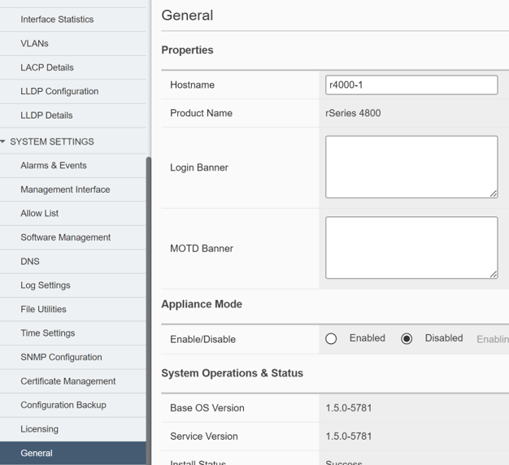
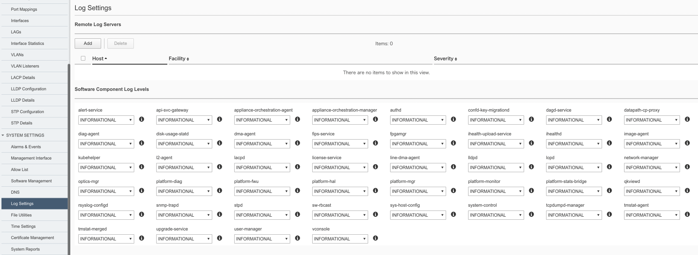
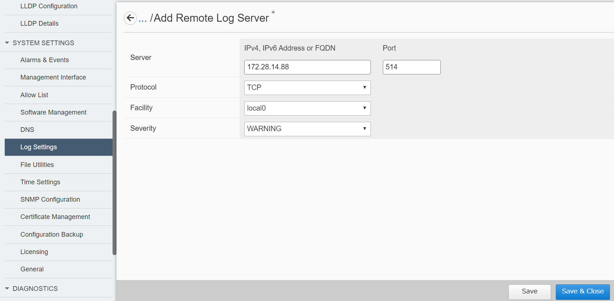

1.2.F5OS 基本設定
########

本手順ではWebGUIを使用してF5OSの基本設定をする方法を紹介します。

1.2.1. WebUIへのログイン
--------------

ログイン画面にデフォルトのID ``admin`` 、およびパスワード ``admin`` でログインします。

.. image:: ./media/login.png
      :width: 250

パスワードの変更を求められるため、現在のパスワードを入力後、

新しいパスワードを２回入力してください。

.. NOTE::
   パスワードは複数世代にわたって管理されるため、類似性の高いパスワードを使いまわすことはできません。
   また、セキュリティの観点から、辞書用語やキーボード上並んだ位置にある文字の羅列等、およびデフォルトパスワードである ``admin`` はパスワードとして設定できません。

パスワードの変更が完了すると再度ログインを求められます。

ID ``admin`` と新しいパスワードでログインしてください。

1.2.2. Hostnameの設定
--------------

画面左側にあるメニューバーから ``SYSTEM SETTINGS >> General`` を選択し、一般設定画面を開きます。

Hostnameを入力し、画面右下にある ``Save`` をクリックして保存します。

.. NOTE::
   F5OSのSyslog設定で外部にログを配信する場合には、当該設定後にも送信元ホスト名は *appliance-1* として表示されます。

1.2.3. ライセンスの設定
--------------

画面左側のメニューバーから ``SYSTEM SETTINGS >> Licensing`` を選択し、ライセンス適用画面を開きます。

ライセンスキーを入力し、有効化のメソッドを選択します。

.. NOTE::
   rSeriesでは、F5OSに適用されたライセンスがテナントに継承されます。
   そのためライセンス管理はF5OS側での一括管理となります。
   また、有効化メソッドのうちAutomaticについては対象機器がインターネットへ接続できる必要があります。
   クローズド環境で使用される機器についてはManualによるライセンス有効化を実施ください。

1.2.3-1. Automaticでのライセンス有効化する
~~~~~~~~
Automaticを選択し、 ``Activate`` をクリックします。

ライセンスに関するエンドユーザ同意事項がポップアップで表示されるため、

ご一読のうえ、同意いただくことで有効化が開始されます。

ライセンスの有効化が完了すると旨ポップアップが出ます。

1.2.3-2. Manualでのライセンス有効化する
~~~~~~~~
Manualを選択し、 ``Get Dossier.png`` をクリックします。

表示されたDossierをクリップボードにコピーします。

Licensing Server項目にある ``Click here to access F5 Licensing Server`` をクリックしてF5 Licensing Serverにブラウザ接続します。

WebUIページにてコピーしたDossierをEnter Your Dossier欄へペーストし、 ``Next`` をクリックします。

ライセンスに関するエンドユーザ同意事項が表示されるため、

ご一読のうえ、同意いただくことで ``Next`` をクリック可能になります。

ライセンスが表示されるため、クリップボードにコピーします。

WebUIに戻り、License Textへライセンスをペーストします。

``Activate`` をクリックします。ライセンスの有効化が完了するとその旨ポップアップが出ます。

1.2.4. DNSサーバの設定
--------------

画面左側のメニューバーから ``SYSTEM SETTINGS >> DNS`` を選択し、DNS設定画面を開きます。

DNS Lookup Serversの項目にて ``Add`` を選択し、DNSサーバのIP addressを入力し、

``Save & Close`` をクリックして設定を保存します。

1.2.5. 時刻設定
--------------

画面左側のメニューバーから ``SYSTEM SETTINGS >> Time Setings`` を選択し、時刻設定画面を開きます。

時刻設定ではNTPサーバとタイムゾーンの設定ができます。

1.2.5-1. NTP Serverの設定
~~~~~~~~
NTP Serversの項目にて ``Add`` を選択し、NTPサーバのHostnameを入力し、

``Save & Close`` をクリックして設定を保存します。

1.2.5-2. Time Zoneの設定 
~~~~~~~~
Time Zoneの項目にてドロップダウンリストから該当するタイムゾーンを選択します。

1.2.5-3. 時刻同期の確認 
~~~~~~~~
F5OS-Aで時刻同期が行われているかどうかの確認は、F5OS-AのCLIにrootでログインして、「chronic sources」コマンドを実行してください。

.. code-block:: cmdin

   [root@appliance-1 ~]# chronyc sources
   210 Number of sources = 2
   MS Name/IP address         Stratum Poll Reach LastRx Last sample
   ===============================================================================
   ^? 172.28.15.123                 0   8     0     -     +0ns[   +0ns] +/-    0ns     <-----時刻同期ができていない
   ^* 172.28.15.253                 2   6   377    20    +19us[  +21us] +/-   33ms　　　<-----時刻同期ができている

1.2.6. ログ設定
--------------

画面左側のメニューバーから ``SYSTEM SETTINGS >> Log Setings`` を選択し、ログ設定画面を開きます。

ログ設定ではリモートログサーバとログの出力レベルの設定ができます。

1.2.6-1. 外部ログサーバの設定　
~~~~~~~~
外部のログサーバへログを転送する場合には、Remote Log Serversの項目にて ``Add`` を選択し、

転送先のIP address、Portを入力します。

``Save & Close`` をクリックして設定を保存します。

1.2.6-2. ログ出力レベルの設定
~~~~~~~~
Software Component Log Levels項目にてドロップダウンリストから各コンポーネントのログ出力レベルを選択します。

変更完了しましたら、 ``Save`` をクリックして設定を保存します。

1.2.6-3. ログ確認
~~~~~~~~
出力されたログファイルは ``SYSTEM SETTINGS >> File Utilities`` から確認可能です。

Base Directory項目にてドロップダウンリストから ``log/system`` を選択し、

確認したいログファイルをエクスポートします。

1.2.7. SNMP設定
--------------
SNMPリクエストを受けるけるためには接続許可リストへの追加、およびSNMP設定が必要です。

1.2.7-1. 許可リストへの追加設定　
~~~~~~~~
画面左側のメニューバーから ``SYSTEM SETTINGS >> Allow List`` を選択し、許可リスト設定画面を開きます。

``Add`` をクリックして追加画面へ遷移し、SNMPマネージャーのIP address および接続予定Port(161 SNMP)を設定します。

``Save & Close`` をクリックして設定を保存します。

1.2.7-2. SNMPの設定
~~~~~~~~
画面左側のメニューバーから ``SYSTEM SETTINGS >> SNMP Configuration`` を選択し、SNMP設定画面を開きます。

``Add`` をクリックし、使用予定のSNMPバージョンに応じてCommunity、Userを追加します。

変更完了しましたら、 ``Save & Close`` をクリックして設定を保存します。

