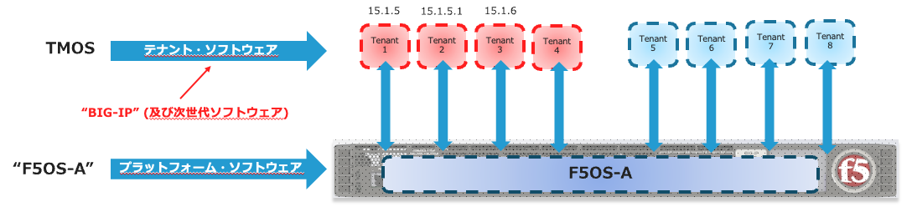

F5OSとは
####

F5OSとは、F5 rSeriesアプライアンスプラットフォームの基盤となるオペレーティング システムであり、

基本 OS ソフトウェアとプラットフォーム レイヤ サービス コンポーネントを含む単一のISOイメージとして配布されます。

F5 rSeriesプラットフォームにはシステムコントローラやシャーシパーティションがないため、個別のISOイメージファイルは必要ありません。
rSeriesでは、F5OSを必ず稼働させる必要があります。

以下の図は、rSeriesのソフトウェア構成です。

F5OSはKubernetes (K3S)ベースで開発されており、その上で従来のTMOSまたは今後リリース予定の次世代ソフトウェアがテナントとして稼働するアーキテクチャとなります。
r4000以上のアプライアンスでは、複数のテナントを独立させて稼働することが可能です。

※F5OS-A” (“A”は”Appliance”の意味)

.. NOTE::

   iSeriesまたはそれ以前のプラットフォームと互換性がなく、これらのハードウェア プラットフォームは、F5OS をサポートするようには設計されていません。
