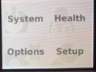
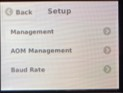
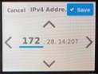
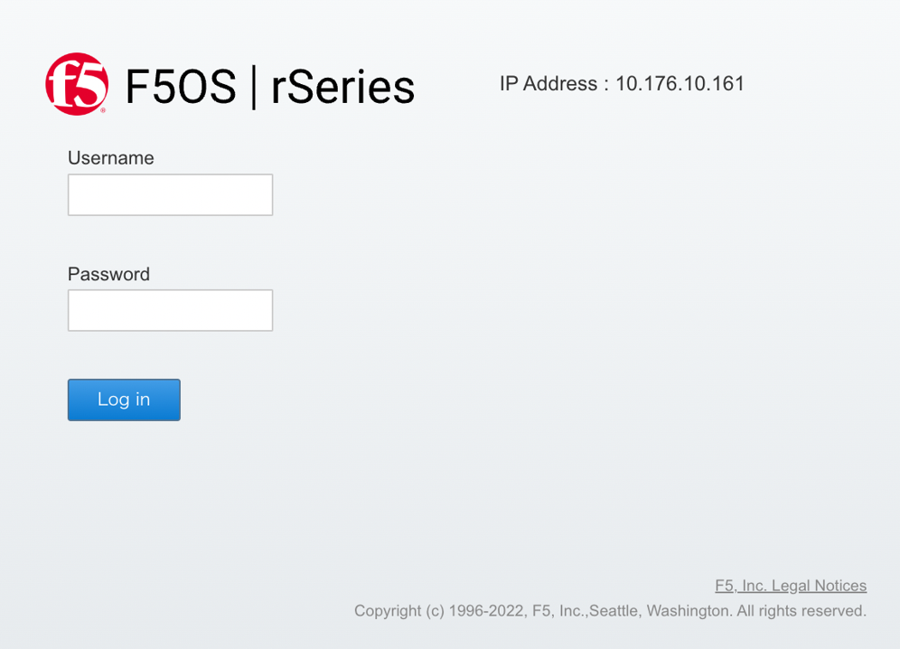

F5OS 管理IP設定
####

本手順ではF5OSの管理IPを設定する手順を紹介します。

設定方法
====
設定方法は以下の2種類があります。

-  フロントパネルから設定する方法
-  コンソールからログインし設定する方法

1. 管理IPの設定
--------------
1-1. フロントパネルを使用した管理IP設定
~~~~~~~~
フロントパネルに触れ、画面を起動します。

``Setup`` を選択します。

``Managememt`` を選択します。

``IPv4`` を選択し、 ``IPv4 Adress`` を選択します。

.. image:: ./media/4.jpg
      :width: 100

上下矢印を使用して管理IPを設定します。

``Save`` をクリックして設定を保存し、Management画面に戻ります。

パネルをスクロールし ``IPv4 Prefix Length`` を選択し、

上下矢印を使用してサブネットマスクを設定します。

``Save`` をクリックして設定を保存し、Management画面に戻ります。
 
.. image:: ./media/6.jpg
      :width: 100

パネルをスクロール ``IPv4 Gateway`` を選択し、

上下矢印を使用してデフォルトゲートウェイを設定します。

``Save`` をクリックして設定を保存し、Management画面に戻ります。

.. image:: ./media/6.jpg
     :width: 100

``commit`` をクリックし、設定内容を反映します。

1-2. コンソールログインを使用した管理IP設定
~~~~~~~~
コンソールに接続し、adminでログインします。

続いてConfigモードに移行します。

.. code-block:: cmdin

   r10k-2# config

管理IPのIPアドレス、サブネットマスク長、デフォルトGatewayのIPアドレスを設定します。

.. code-block:: cmdin

   r10k-2(config)# system mgmt-ip config ipv4 system address 10.176.10.161
   r10k-2(config)# system mgmt-ip config ipv4 prefix-length 24
   r10k-2(config)# system mgmt-ip config ipv4 gateway 10.176.10.1

最後にコミットし、設定を反映します。

.. code-block:: cmdin

   r10k-2(config)# commit

2. 内部通信に使用するアドレスの変更
--------------
rSeriesでは、内部通信用に”100.64.0.0/12” (デフォルト)を予約済みです。

データ通信 (In-band)のトラフィックと重複しても影響はありませんが、Management Interface (Out-of-band)のIPアドレスと重複する場合、通信に支障をきたします。

この場合には当該手順を実施し、内部通信に使用するアドレスを変更します。

下記コマンドにより内部通信に使用しているアドレスを確認できます。

.. code-block:: cmdin

   r10k-2# show system network

ご使用予定の環境に合わせ、Out-of-band通信と重複しないようアドレス種別を変更します。

`RFC` まで入力し、`Tab` キーを入力すると選択可能なアドレスの種類が表示できます。

.. code-block:: cmdin

   r10k-2# config
   r10k-2(config)# system network config network-range-type RFC
    Possible completions:  #デフォルトRFC6598
    RFC1918   System uses 10.[0-15]/12 as specified by RFC1918
    RFC6598   System uses 100.64/10 as specified by RFC6598
   r10k-2(config)# system network config network-range-type RFC1918
   r10k-2(config)# commit

3. WeUIへのログイン
--------------
``https://<管理IP address>`` によって設定した管理IPへGUI接続します。

