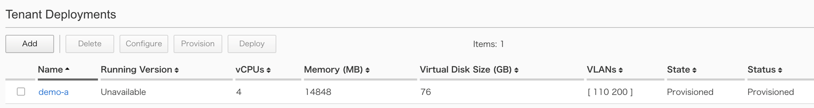

2.2. テナントのリサイズ
########

以下の手順でテナントをリサイズします。

``TENANT MANAGEMENT >> Tenant Deployments`` において対象テナントを選択し、状態を ``Provisione`` へ変更します。

テナントのstatusがProvisionedとなったらテナント名をクリックし、設定画面においてリソースサイズを変更します。

.. NOTE::
   Resource ProvisioningにおいてRecommendedを選択している場合、
   vCPUの数に応じてメモリ量は自動的に変更されます。

