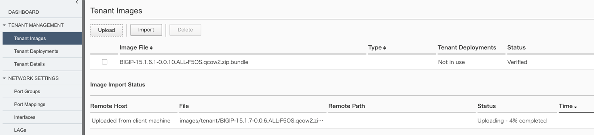

2.1. Tenantのデプロイ
########

以下の手順でテナントをデプロイします。

2.1. テナントイメージのダウンロード
--------------
\ `F5 downloads <https://my.f5.com/s/downloads>`__ から使用するテナントのイメージファイルをダウンロードします。

.. NOTE::
   利用するイメージによってぢ要可能なテナント数が異なります。
   詳細情報は\ `Overview of the BIG-IP tenant image types <https://support.f5.com/csp/article/K45191957>`__
   をご参照ください。

2.2. テナントイメージのアップロード
--------------
画面左側にあるメニューバーから ``TENANT MANAGEMENT >> Tenant Images`` を選択し、テナントイメージの管理画面を開きます。

``Upload`` をクリックしアップロードするイメージファイルを選択します。

2.3. テナントの設定
--------------
画面左側にあるメニューバーから ``TENANT MANAGEMENT >> Tenant Deployments`` を選択し、 ``Add`` をクリックします。

作成するテナント名、および使用するイメージファイル、およびテナントの管理インターフェースを設定します。

リソースプロビジョニング項目ではRecommended/Advancedを選択可能であり、Recommendedを選択する場合テナントに割り当てるメモリは自動的に決定されます。

テナントに割り当てるリソースを設定し、テナントの状態をConfigured/Provisioning/Deoloyedから選択可能です。

.. NOTE::
  Stateが *Deployed* になっている場合には、BIG-IPテナントを停止した場合でも自動で起動するようにF5OS-A側で制御するため、
  テナントを停止する場合には、StateをDeployedからProvisionedに変更する必要があります。

.. image:: ./media/tenant-deploy.png
      :width: 250

デプロイが完了するとテナントのstatusが ``Running`` となり、Running Versionに稼働中のTMOSバージョンが表示されます。

.. image:: ./media/tenant-deployed.png
      :width: 500

