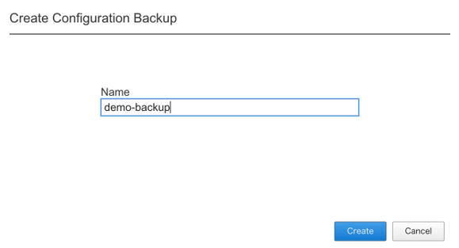

4.設定の保存とリストア
########

以下の手順でF5OSの設定を保存します。

4-1. Primary-keyの設定
~~~~~~~~
対象機器にCLIで接続し、adminアカウントでログインします。

.. NOTE::
   バックアップした機器と異なる筐体にリストアを適用する際にPrimary-keyが必要になることがあります。

Configモードに移行し、 ``passphrase`` と ``salt`` を設定します。

.. code-block:: cmdin

   r10k-2# config
   Entering configuration mode terminal
   r10k-2(config)#
   r10k-2(config)# system aaa primary-key set passphrase ``Enter key`` 
    passphrase: ************
    confirm-passphrase: ************
    salt: *********** 
    confirm-salt: ***********
   r10k-2(config)# end

ステータスを確認し、設定が完了していることを確認します。

.. code-block:: cmdin

   r10k-2# show system aaa primary-key state status

4-2. バックアップファイルの作成
~~~~~~~~
対象機器へWebUIで接続し、adminアカウントでログインします。

画面左側にあるメニューバーから ``SYSTEM SETTINGS >> Configuration Backup`` を選択します。

``Create`` をクリックし、ファイル名を入力して ``Create`` をクリックします。

.. seealso::
   F5OSのバックアップファイル内には、テナントに割り当てるリソース等のデプロイにおいて指定するデプロイ構成が含まれますが、
   Virtual Serverをはじめとするテナント内で設定するコンポーネントについては含まれないため、別途テナント内でUCSを作成する必要があります。
   `UCSの取得 <https://f5j-easy-setup-ltm-17.readthedocs.io/ja/latest/content07/content07.html#ucs>`_
   をご参照ください。

4-3. 設定のリストア
~~~~~~~~
対象機器にCLIで接続し、adminアカウントでログインします。

.. code-block:: cmdin

   r10k-2# config
   r10k-2(config)#

コンフィグを一度初期化し、バックアップファイルからリストアします。

.. code-block:: cmdin

   r10k-2(config)#
   r10k-2(config)# system database reset-to-default
   Removing all user configuration will delete all tenants and stop traffic processing.
   Proceed? [yes/no]: yes
   r10k-2(config)#
   r10k-2(config)# system database config-restore name <backup-file-name>
   A clean configuration is required before restoring to a previous configuration.
   Please perform a reset-to-default operation if you have not done so already.
   Proceed? [yes/no]: yes
   result Database config-restore successful.
   r10k-2(config)#
   System message at 20xx-xx-xx xx:xx:xx...
   Commit performed by admin via tcp using cli.
   r10k-2(config)#

.. seealso::
   F5OSのリストアにより、テナントに割り当てるリソース等のデプロイにおいて指定するデプロイ構成がリストアされますが、
   Virtual Serverをはじめとするテナント内で設定するコンポーネントについて、別途テナント内でUCSからリストアする必要があります。
   `UCSのリストア <https://f5j-easy-setup-ltm-17.readthedocs.io/ja/latest/content09/content09.html#ucs>`_
   をご参照ください。

