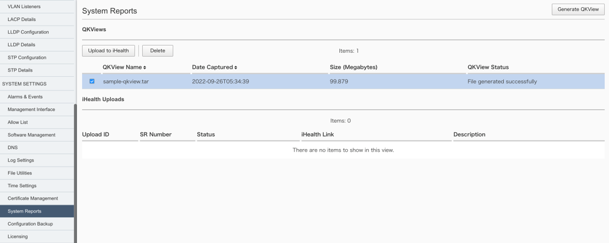
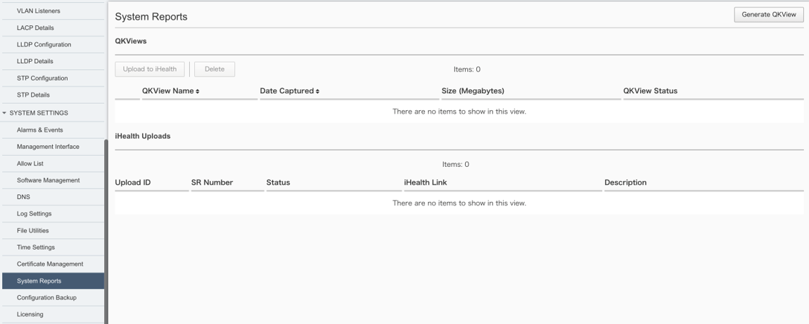
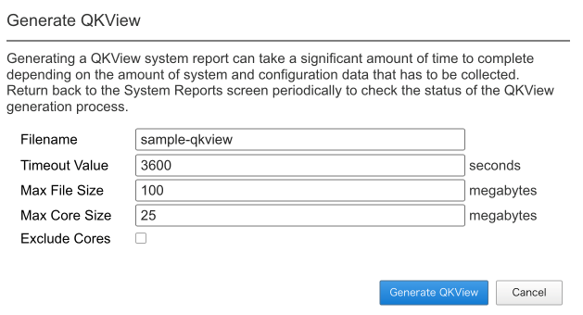
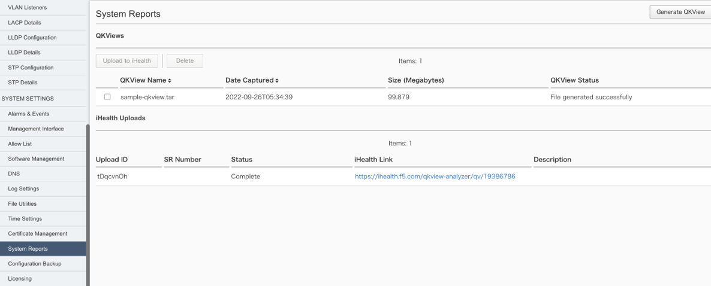

5. トラブル発生時の操作
########

本章では、WebUIを使ったF5OSの障害発生時の操作方法について、ご紹介致します。

5.1. QKviewの取得
--------------

画面左側にあるメニューバーから ``SYSTEM SETTINGS >> System Reports`` を選択し、システムレポートの管理画面を開きます。

``Gennerate QKView`` をクリックしQKviewの作成を開始します。

.. image:: ./media/Generate-QKView.png
      :width: 400

ファイル名を入力し ``Generate QKView`` をクリックするとQKviewが作成されます。

.. image:: ./media/Generate-QKView2.png
      :width: 400

QKvieWの作成が完了するとQKViews項目にて確認できます。

5.2. iHealthへのアップロード
--------------

画面左側にあるメニューバーから ``SYSTEM SETTINGS >> System Reports`` を選択し、システムレポートの管理画面を開きます。

アップロード対象のQkviewを選択し、 ``Upload to iHealth`` をクリックします。

ユーザ名とパスワードを入力し ``Upload`` をクリックするとQKviewがiHealthへアップロードされます。

アップロードが完了すると ``iHealth Uploads`` 項目のStatusが　``Analyzing`` から ``Complete`` へ変更されます。

