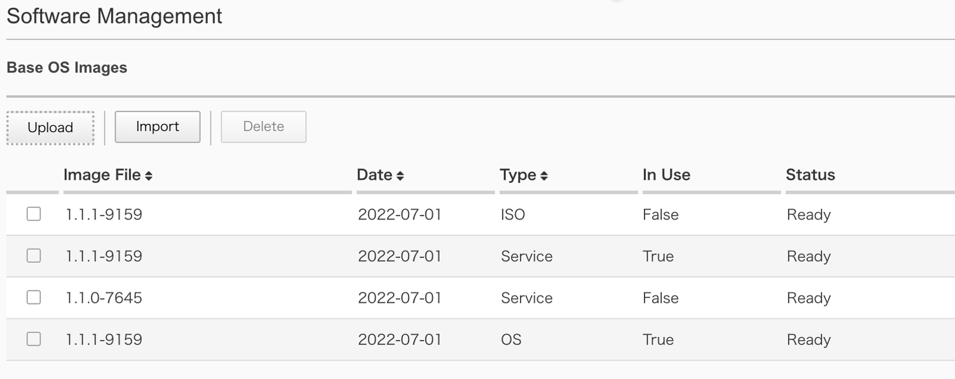
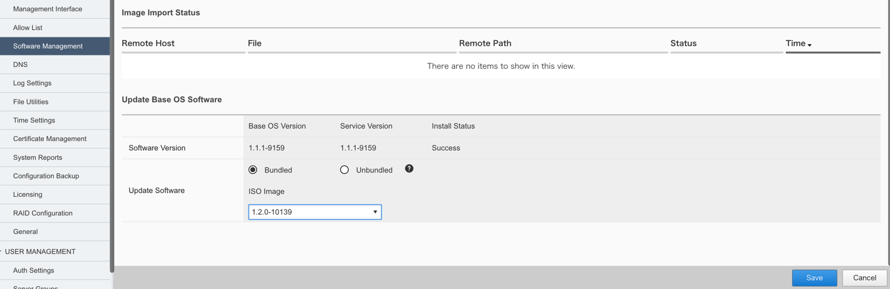

3.F5OSのアップグレード
########

本手順ではWebGUIを使用してF5OSをアップグレードする手順を紹介します。

. F5OSのアップグレード
--------------
3-1. F5OSイメージのダウンロード
~~~~~~~~
\ `F5 downloads <https://my.f5.com/s/downloads>`__ から使用するテナントのイメージファイルをダウンロードします。

.. NOTE::
   利用する機種によって適用するイメージファイルが異なります。
   r2000/r4000用のイメージファイルとr5000/r10000シリーズ用のイメージファイルがあるためご注意ください。

3-2. F5OSイメージのアップロード
~~~~~~~~

画面左側にあるメニューバーから ``SYSTEM SETTINGS >> Software Management`` を選択し、F5OSイメージの管理画面を開きます。

Base OS Images項目にある ``Upload`` をクリックしアップロードするイメージファイルを選択します。

3-3. F5OSイメージのアップグレード
~~~~~~~~
F5OSイメージのアップロードが完了したら、Update Base OS Software項目において ``Bundled`` を選択し、

ドロップダウンリストからアップグレード先のバージョンを選択します。

``Save`` をクリックし、アップグレードとそれに伴い管理セッションが終了する旨通達するポップアップに対して ``OK`` をクリックします。

アップグレードが完了したら再度WebGUIに接続可能になります。

Software Managementページ内Software Version項目において、稼働しているバージョンが更新されていることを確認し、F5OSのアップグレードは完了となります。

