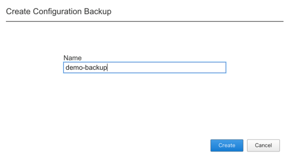

4.F5OSの設定保存(バックアップ)
########

以下の手順でF5OSの設定を保存します。

4-1. Primary-keyの設定
~~~~~~~~
対象機器にCLIで接続し、adminアカウントでログインします。

.. NOTE::
   バックアップした機器と異なる筐体にリストアを適用する際にPrimary-keyが必要になることがあります。

Configモードに移行し、PassphraseとSaltを設定します。

.. code-block:: cmdin

   r10k-2# config
   Entering configuration mode terminal
   r10k-2(config)#
   r10k-2(config)# system aaa primary-key set passphrase ``Enter key`` 
    passphrase: ************
    confirm-passphrase: ************
    salt: *********** 
    confirm-salt: ***********
   r10k-2(config)# end

ステータスを確認し、設定が完了していることを確認します。

.. code-block:: cmdin

   r10k-2# show system aaa primary-key state status

4-2. バックアップファイルの作成
~~~~~~~~
対象機器へWebUIで接続し、adminアカウントでログインします。

画面左側にあるメニューバーから ``SYSTEM SETTINGS >> Configuration Backup`` を選択します。

``Create`` をクリックし、ファイル名を入力して ``Create`` をクリックします。

.. NOTE::
   F5OSのバックアップファイル内には、テナントに割り当てるリソース等のデプロイにおいて指定するデプロイ構成が含まれますが、
   Virtual Serverをはじめとするテナント内で設定するコンポーネントについては含まれないため、別途テナント内でUCFファイルを作成する必要があります。
