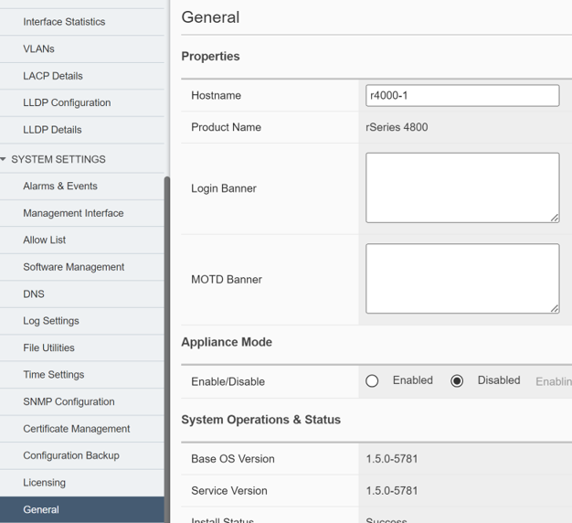

一般設定
####

設定方法
====
本手順ではWebGUIを使用して設定する方法を紹介します。

====

1.Hostnameの設定
~~~~~~~~

フロントパネルに触れ、画面を起動してください。

2.ライセンスの設定
~~~~~~~~

画面左側のメニューバーから

.. image:: ./media/license.png
      :width: 250

.. NOTE::
   rSeriesでは、F5OSに適用されたライセンスがテナントにも継承されます。
   ライセンス管理はF5OS側で一括で管理することができます。

3.DNSサーバの設定
~~~~~~~~

下記コマンドにより内部通信に使用しているアドレスを確認できます。

.. image:: ./media/dns server.png
      :width: 250

