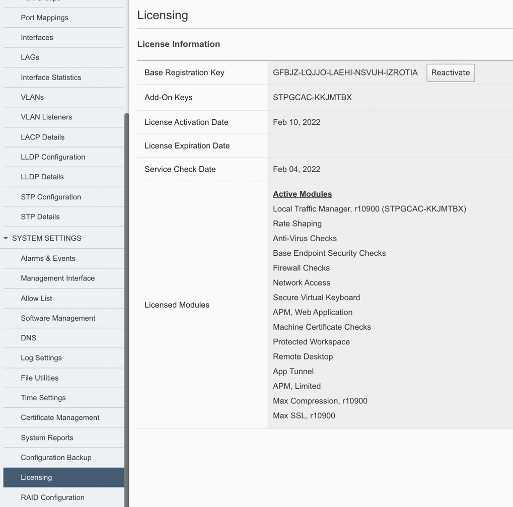
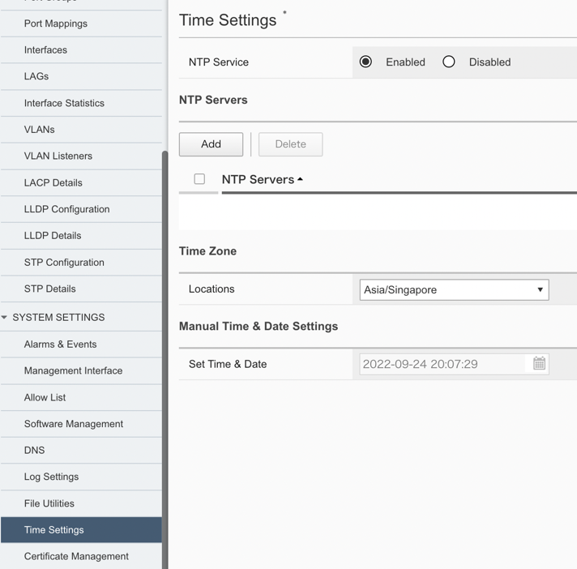
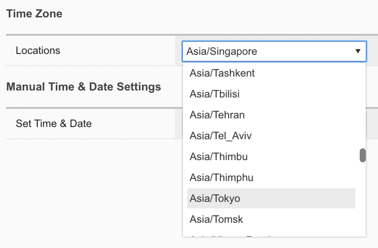

基本設定
####

設定方法
====
本手順ではWebGUIを使用してF5OSの基本設定をする方法を紹介します。

====

1.Hostnameの設定
~~~~~~~~

画面左側にあるメニューバーから ``SYSTEM SETTINGS >> General`` を選択し、一般設定画面を開いてください。

Hostnameを入力し、画面右下にある ``Save`` をクリックして保存してください。

.. NOTE::
   F5OSのSyslog設定で外部にログを配信する場合には、当該設定後にも送信元ホスト名は *appliance-1* として表示されます。

.. image:: ./media/host-name.png
      :width: 250

2.ライセンスの設定
~~~~~~~~

画面左側のメニューバーから ``SYSTEM SETTINGS >> Licensing`` を選択し、ライセンス適用画面を開いてください。

ライセンスキーを入力し、

.. NOTE::
   rSeriesでは、F5OSに適用されたライセンスがテナントに継承されます。
   そのためライセンス管理はF5OS側での一括管理となります。

3.DNSサーバの設定
~~~~~~~~

画面左側のメニューバーから ``SYSTEM SETTINGS >> DNS`` を選択し、DNS設定画面を開いてください。

DNS Lookup Serversの項目にて ``Add`` を選択し、DNSサーバのIP addressを入力し、 ``Save & Close`` をクリックして設定を保存してください。

.. image:: ./media/dns-server.png
      :width: 250

4.時刻設定
~~~~~~~~

画面左側のメニューバーから ``SYSTEM SETTINGS >> Time Setings`` を選択し、時刻設定画面を開いてください。

時刻設定ではNTPサーバとタイムゾーンの設定ができます。

| 4-1.　NTP Serversの項目にて ``Add`` を選択し、NTPサーバのHostnameを入力し、 ``Save & Close`` をクリックして設定を保存してください。

.. image:: ./media/time-server.png
      :width: 250

| 4-2. Time Zoneの項目にてドロップダウンリストから該当するタイムゾーンを選択してください。

