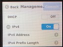
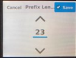

管理IP設定
####

設定方法
====
設定方法は以下の２種類があります。

-  フロントパネルから設定する方法
-  コンソールからログインし設定する方法

====

1.フロントパネルから設定する手順
~~~~~~~~

フロントパネルに触れ、画面を起動してください。

``Setup`` を選択してください。

.. image:: ./media/2.jpg
      :width: 100

``Managememt`` を選択してください。

.. image:: ./media/3.jpg
          :width: 100

``IPv4`` を選択し、 ``IPv4 Adress`` を選択してください。

上下矢印を使用して管理IPを設定してください。
設定完了しましたら ``Save`` をクリックして設定を保存し、Management画面に戻ってください。

.. image:: ./media/5.jpg
      :width: 100

パネルをスクロールし ``IPv4 Prefix Length`` を選択し、
上下矢印を使用してサブネットマスクを設定してください。
設定完了しましたら ``Save`` をクリックして設定を保存し、Management画面に戻ってください。
 

パネルをスクロール ``IPv4 Gateway`` を選択し、上下矢印を使用してデフォルトゲートウェイを設定してください。
設定完了しましたら ``Save`` をクリックして設定を保存し、Management画面に戻ってください。

``commit`` をクリックし、設定内容を反映してください。

2.コンソールからログインし設定する手順
~~~~~~~~

コンソールに接続し、adminでログインする
Configモードに移行する

.. code-block:: cmdin

   r10k-2# config

管理IPのIPアドレス、サブネットマスク長、デフォルトGatewayのIPアドレスを設定する

.. code-block:: cmdin

   r10k-2(config)# system mgmt-ip config ipv4 system address 10.176.10.161
   r10k-2(config)# system mgmt-ip config ipv4 prefix-length 24
   r10k-2(config)# system mgmt-ip config ipv4 gateway 10.176.10.1

設定を反映する

.. code-block:: cmdin

   r10k-2(config)# commit

.. NOTE::
   rSeriesでは、内部通信用に”100.64.0.0/12” (デフォルト)を予約済みです。
   データ通信 (In-band)のトラフィックと重複しても影響はありませんが、Management Interface (Out-of-band)のIPアドレスと重複する場合、通信に支障をきたします。
   この場合には手順3を実施し、内部通信に使用するアドレスを変更してください。

3.内部通信に使用するアドレスを変更する手順（option）
~~~~~~~~

下記コマンドにより内部通信に使用しているアドレスを確認できます。

.. code-block:: cmdin

   r10k-2# show system network

ご使用予定の環境に合わせ、Out-of-band通信と重複しないようアドレス種別を変更してください。

`RFC` まで入力し、`Tab` キーを入力すると選択可能なアドレスの種類が表示できます。

.. code-block:: cmdin

   r10k-2# config
   r10k-2(config)# system network config network-range-type RFC
    Possible completions:  #デフォルトRFC6598
    RFC1918   System uses 10.[0-15]/12 as specified by RFC1918
    RFC6598   System uses 100.64/10 as specified by RFC6598
   r10k-2(config)# system network config network-range-type RFC1918
   r10k-2(config)# commit

4.設定した管理IPを利用してログインする手順
~~~~~~~~

設定した管理IPへ "https://<管理IP address>" を利用してGUIアクセスできるようになります。

.. image:: ./media/login.jpg
      :width: 100
