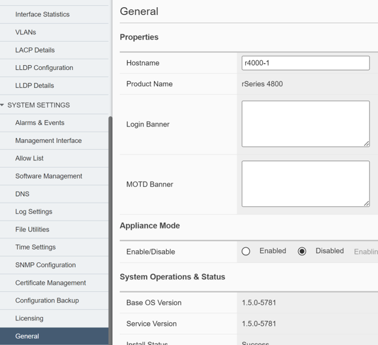
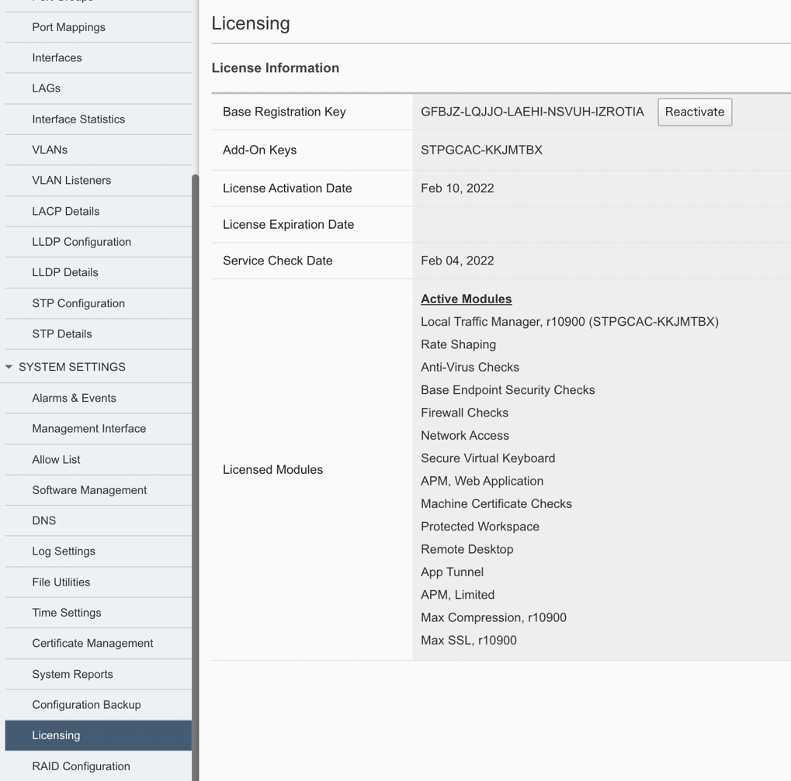
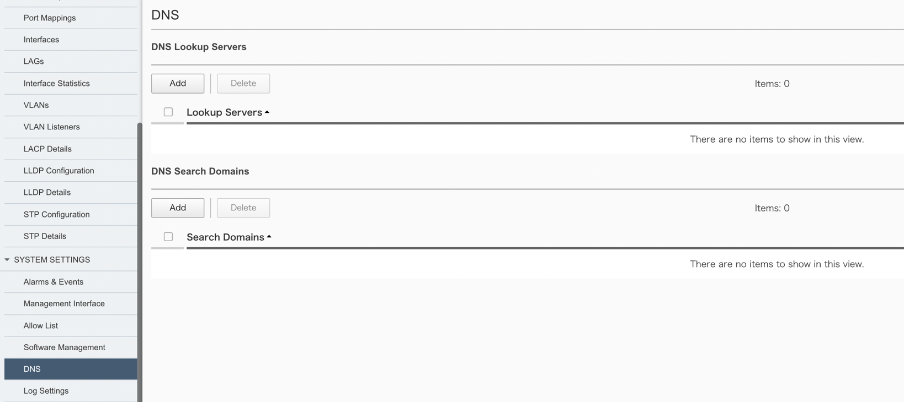
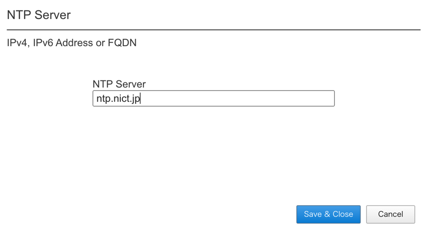
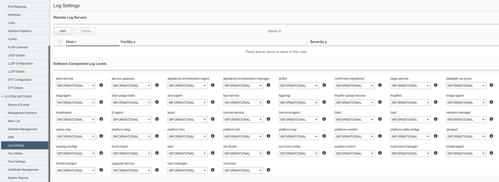
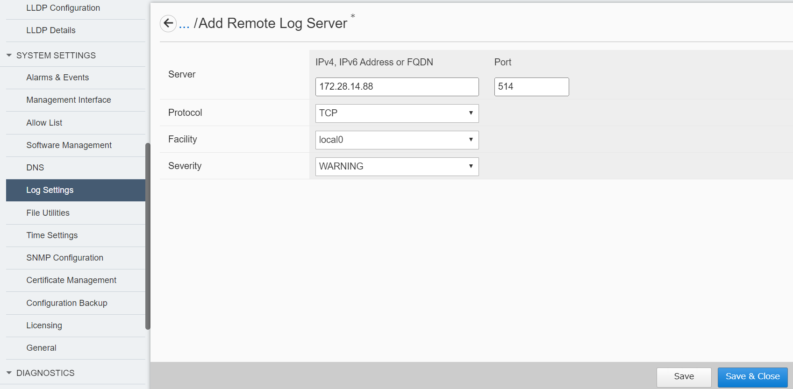
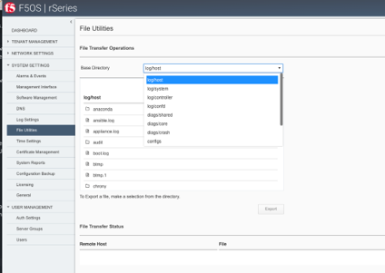
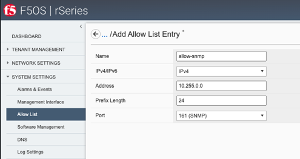
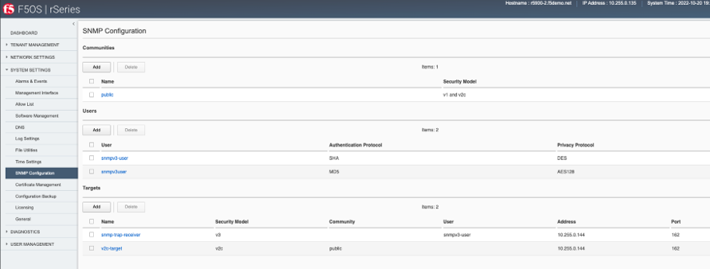

F5OS 基本設定
########

本手順ではWebGUIを使用してF5OSの基本設定をする方法を紹介します。

1. Hostnameの設定
--------------

画面左側にあるメニューバーから ``SYSTEM SETTINGS >> General`` を選択し、一般設定画面を開きます。

Hostnameを入力し、画面右下にある ``Save`` をクリックして保存します。

.. NOTE::
   F5OSのSyslog設定で外部にログを配信する場合には、当該設定後にも送信元ホスト名は *appliance-1* として表示されます。

2. ライセンスの設定
--------------

画面左側のメニューバーから ``SYSTEM SETTINGS >> Licensing`` を選択し、ライセンス適用画面を開きます。

ライセンスキーを入力し、

.. NOTE::
   rSeriesでは、F5OSに適用されたライセンスがテナントに継承されます。
   そのためライセンス管理はF5OS側での一括管理となります。

3. DNSサーバの設定
--------------

画面左側のメニューバーから ``SYSTEM SETTINGS >> DNS`` を選択し、DNS設定画面を開きます。

DNS Lookup Serversの項目にて ``Add`` を選択し、DNSサーバのIP addressを入力し、

``Save & Close`` をクリックして設定を保存します。

4. 時刻設定
--------------

画面左側のメニューバーから ``SYSTEM SETTINGS >> Time Setings`` を選択し、時刻設定画面を開きます。

時刻設定ではNTPサーバとタイムゾーンの設定ができます。

.. image:: ./media/time.png
      :width: 250

4-1. NTP Serverの設定
~~~~~~~~
NTP Serversの項目にて ``Add`` を選択し、NTPサーバのHostnameを入力し、

``Save & Close`` をクリックして設定を保存します。

4-2. Time Zoneの設定 
~~~~~~~~
Time Zoneの項目にてドロップダウンリストから該当するタイムゾーンを選択します。

.. image:: ./media/time-zone.png
      :width: 250

5. ログ設定
--------------

画面左側のメニューバーから ``SYSTEM SETTINGS >> Log Setings`` を選択し、ログ設定画面を開きます。

ログ設定ではリモートログサーバとログの出力レベルの設定ができます。

5-1. 外部ログサーバの設定　
~~~~~~~~
外部のログサーバへログを転送する場合には、Remote Log Serversの項目にて ``Add`` を選択し、

転送先のIP address、Portを入力します。

``Save & Close`` をクリックして設定を保存します。

5-2. ログ出力レベルの設定
~~~~~~~~
Software Component Log Levels項目にてドロップダウンリストから各コンポーネントのログ出力レベルを選択します。

変更完了しましたら、 ``Save`` をクリックして設定を保存します。

5-3. ログ確認
~~~~~~~~
出力されたログファイルは ``SYSTEM SETTINGS >> File Utilities`` から確認可能です。

Base Directory項目にてドロップダウンリストから ``log/system`` を選択し、

確認したいログファイルをエクスポートします。

6. SNMP設定
--------------
SNMPリクエストを受けるけるためには接続許可リストへの追加、およびSNMP設定が必要です。

6-1. 許可リストへの追加設定　
~~~~~~~~
画面左側のメニューバーから ``SYSTEM SETTINGS >> Allow List`` を選択し、許可リスト設定画面を開きます。

``Add`` をクリックして追加画面へ遷移し、SNMPマネージャーのIP address および接続予定Port(161 SNMP)を設定します。

``Save & Close`` をクリックして設定を保存します。

6-2. SNMPの設定
~~~~~~~~
画面左側のメニューバーから ``SYSTEM SETTINGS >> SNMP Configuration`` を選択し、SNMP設定画面を開きます。

``Add`` をクリックし、使用予定のSNMPバージョンに応じてCommunity、Userを追加します。

変更完了しましたら、 ``Save & Close`` をクリックして設定を保存します。

