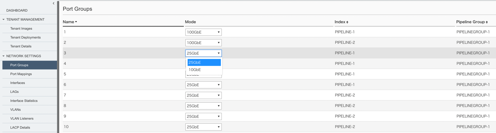

Network設定
########

本手順ではWebGUIを使用してF5OSのNetwork設定をする方法を紹介します。

1.Port Groupsの設定
--------------

画面左側にあるメニューバーから ``NETWORK SETTINGS >> Port Goups`` を選択し、ポートグループの設定画面を開いてください。

各インターフェースで使用する通信スピードを設定できます。

1-1.　r2000/r4000における設定
~~~~~~~~

ドロップダウンリストから使用するポートグループのモードを選択し、

``Save`` をクリックして設定を反映してください。

.. NOTE::
   Port groupのプロファイル変更の際には機器全体の再起動を伴います。
   機器再起動後、プロファイル内で有効になっているインターフェースのみが画面に表示されます。

.. image:: ./media/port-groups-2k4k.png
      :width: 250

1-2.　r5000/r10000における設定
~~~~~~~~
各インターフェースごとにドロップダウンリストから通信モードを選択し、

``Save`` をクリックして設定を保存してください。

.. NOTE::
   Port1-2、は100GbE/40GbEを設定できますが、同一のモードを選択する必要があります。
   Port3-10については25GbE/10GbEを選択でき、通信モードは混在することができます。

2. Vlanの設定
--------------

画面左側のメニューバーから ``NETWORK SETTINGS >> Port Goups`` を選択し、vlan設定画面を開いてください。

``Add`` をクリックし、作成するVlanのID、名前を入力してください。

``Save & Close`` をクリックし、設定を保存してください。

.. image:: ./media/vlan.png   .. image:: ./media/vlan-add.png
      :width: 250

