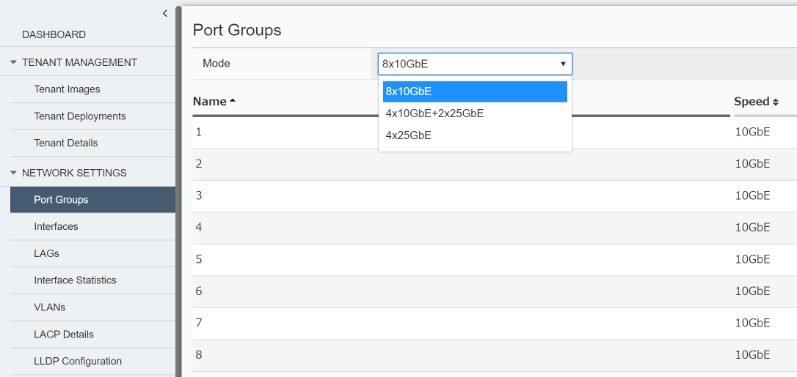
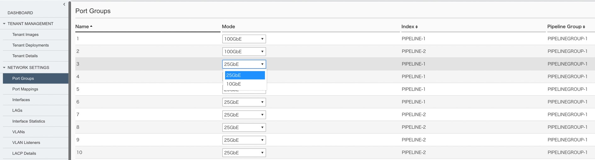
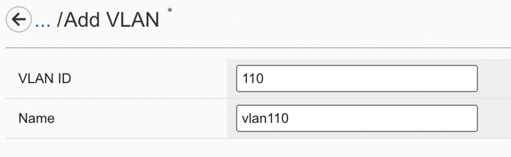
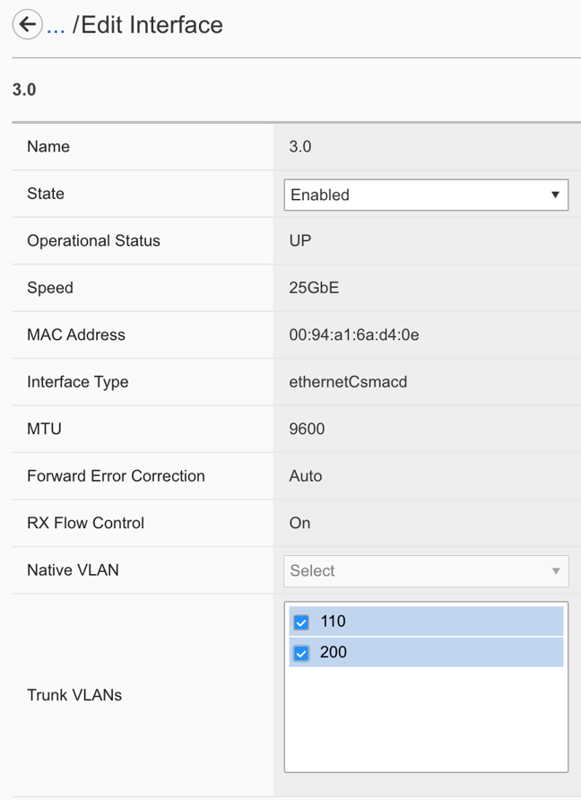
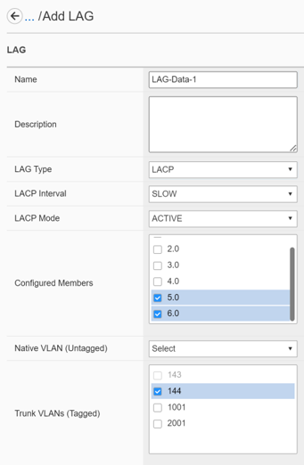

F5OS Network設定
########

本手順ではWebGUIを使用してF5OSのNetwork設定をする手順を紹介します。

rSeriesではネットワーク設定はF5OSで管理し、テナントはF5OSにおける設定を継承します。

1. Port Groupsの設定
--------------

画面左側にあるメニューバーから ``NETWORK SETTINGS >> Port Goups`` を選択し、ポートグループの設定画面を開きます。

各インターフェースで使用する通信スピードを設定できます。

1-1. r2000/r4000における設定
~~~~~~~~

ドロップダウンリストから使用するポートグループのモードを選択し、

``Save`` をクリックして設定を反映します。

.. NOTE::
   Port groupのプロファイル変更の際には機器全体の再起動を伴います。
   機器再起動後、プロファイル内で有効になっているインターフェースのみが画面に表示されます。

1-2. r5000/r10000における設定
~~~~~~~~
各インターフェースごとにドロップダウンリストから通信モードを選択し、

``Save`` をクリックして設定を保存します。

.. NOTE::
   Port1-2、は100GbE/40GbEを設定できますが、同一のモードを選択する必要があります。
   Port3-10については25GbE/10GbEを選択でき、通信モードは混在可能です。

2. Vlanの設定
--------------

画面左側のメニューバーから ``NETWORK SETTINGS >> VLANs`` を選択し、vlan設定画面を開きます。

``Add`` をクリックし、作成するVlanのID、名前を入力します。

``Save & Close`` をクリックし、設定を保存します。

3. Interfaceの設定
--------------

画面左側のメニューバーから ``NETWORK SETTINGS >> Interfaces`` を選択し、設定するインターフェースの名前をクリックします。

割り当てるNative VLANをドロップダウンリストから選択し、Trunk Vlanをチェックボックスから設定します。

``Save & Close`` をクリックし、設定を保存します。

.. NOTE::
   １つのvlanを複数のインターフェースに紐づけることはできないため、
   必要な場合には紐づけるインターフェースをリンクアグリゲーションでまとめる必要があります。

4. LAGの設定
--------------

画面左側のメニューバーから ``NETWORK SETTINGS >> LAGs`` を選択しリンクアグリゲーションの設定画面を開きます。

``Add`` をクリックし、作成するLAGの名前、組み込むインターフェース、および割り当てるvlanを設定します。

``Save & Close`` をクリックし、設定を保存します。

.. NOTE::
   LAG TypeではStatic/LACPを選択可能です。
   LACPを選択する場合にはIntervalとModeの設定が必要です。

