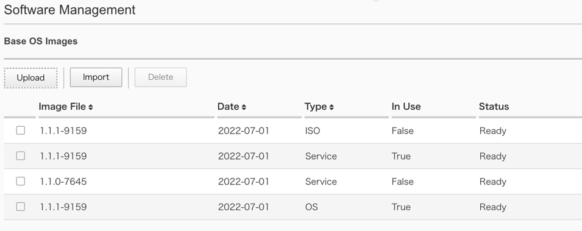
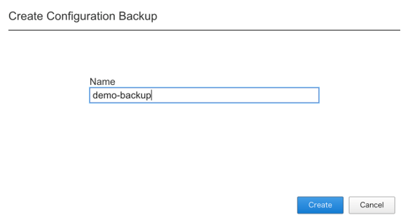

F5OS バージョン管理
########

本手順ではWebGUIを使用してF5OSのバージョン管理をする方法を紹介します。

1. F5OSのアップグレード
--------------

1-1.　F5OSイメージのダウンロード
~~~~~~~~

\ `F5 downloads <https://my.f5.com/s/downloads>`__ から使用するテナントのイメージファイルをダウンロードします。

.. NOTE::
   利用する機種によって適用するイメージファイルが異なります。
   r2000/r4000用のイメージファイルとr5000/r10000シリーズ用のイメージファイルがあるためご注意ください。

1-2.　F5OSイメージのアップロード
~~~~~~~~

画面左側にあるメニューバーから ``SYSTEM SETTINGS >> Software Management`` を選択し、F5OSイメージの管理画面を開いてください。

Base OS Images項目にある ``Upload`` をクリックしアップロードするイメージファイルを選択します。

アップロードが完了したらUpdate Base OS Software項目において ``Bundled`` を選択し、ドロップダウンリストからアップグレード先のバージョンを選択します。

``Save`` をクリックし、アップグレードとそれに伴い管理セッションが終了する旨通達するポップアップに対して ``OK`` をクリックします。

アップグレードが完了したら再度WebGUIに接続可能になります。

Software Managementページ内Software Version項目において、稼働しているバージョンが更新されていることを確認し、F5OSのアップグレードは完了となります。

.. image:: ./media/F5OS-upgrade.png
      :width: 400

2. F5OSのバックアップ
--------------

2-1.　Primary-keyの設定
~~~~~~~~
対象機器にCLIで接続し、adminアカウントでログインします。

.. NOTE::
   バックアップした機器と異なる筐体にリストアを適用する際にPrimary-keyが必要になることがあります。

Configモードに移行し、PassphraseとSaltを設定します。

.. code-block:: cmdin

   r10k-2# config
   Entering configuration mode terminal
   r10k-2(config)#
   r10k-2(config)# system aaa primary-key set passphrase ``Enter key`` 
    passphrase: ************
    confirm-passphrase: ************
    salt: *********** 
    confirm-salt: ***********
   r10k-2(config)# end

ステータスを確認し、設定が完了していることを確認します。

.. code-block:: cmdin

   r10k-2# show system aaa primary-key state status

2-2.　バックアップファイルの作成
~~~~~~~~
対象機器へWebUIで接続し、adminアカウントでログインします。

画面左側にあるメニューバーから ``SYSTEM SETTINGS >> Configuration Backup`` を選択します。

``Create`` をクリックし、ファイル名を入力して ``Create`` をクリックします。

.. NOTE::
   F5OSのバックアップファイル内には、テナントに割り当てるリソース等のデプロイにおいて指定するデプロイ構成が含まれますが、
   Virtual Serverをはじめとするテナント内で設定するコンポーネントについては含まれないため、別途テナント内でUCFファイルを作成する必要があります。
